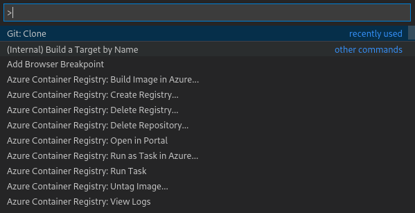
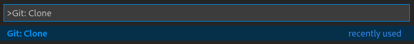
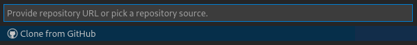
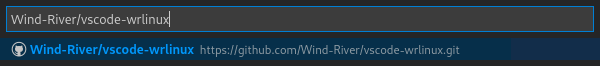
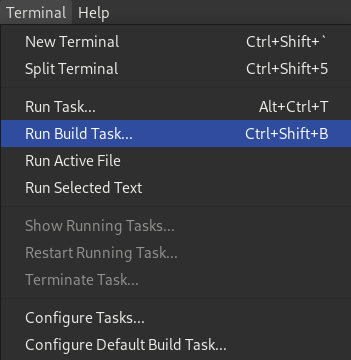
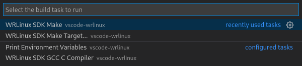
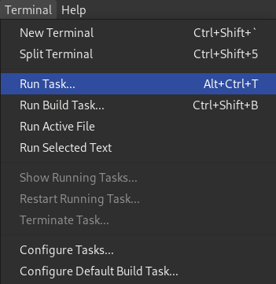
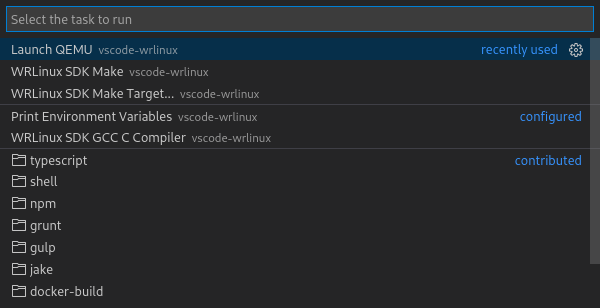

# Wind River Linux for Visual Studio Code

## Overview

Wind River Linux for Visual Studio Code is an extension for Visual Studio Code published by Wind River.  You may install it to use Software Develop Kits (SDKs) on both Linux and Windows development machines.

These instructions are for a 64-bit Intel image based on the intel-x86-64 board support package.  For instructions on how to use the SDK with the Raspberry Pi 4, please refer to the *bcm-2xxx-rpi4* branch.

## Prerequisities

* Visual Studio Code
* C / C++ Extension
* QEMU (qemu-system-x86_64)
* gdb
* make

## Installing the Wind River Linux CD SDK

Download the Intel NUC Software Development Kit (SDK) and Target System Image Full from https://labs.windriver.com/downloads/wrlinux.html .

Uncompress the sdk-intel-x86-64.tar.bz2 and target-full-intel-x86-64.tar.bz2
```
cd $HOME/Downloads
tar -jxvf sdk-intel-x86-64.tar.bz2
tar -jxvf target-full-intel-x86-64.tar.bz2
```

Run the *wrlinux-graphics-10.20.33.0-glibc-x86_64-intel_x86_64-wrlinux-image-full-sdk.sh* shell script to install the SDK to */home/rcwoolley/wrlinuxcd/sdk/intel-x86-64*

NOTE: Substitute /home/rcwoolley for your home directory

```
./wrlinux-graphics-10.20.33.0-glibc-x86_64-intel_x86_64-wrlinux-image-full-sdk.sh

Wind River Linux development SDK installer version 20.33
========================================================
Enter target directory for SDK (default: /opt/windriver/wrlinux-graphics/20.33): /home/rcwoolley/wrlinuxcd/sdk/intel-x86-64
You are about to install the SDK to "/home/rcwoolley/wrlinuxcd/sdk/intel-x86-64". Proceed [Y/n]? y
Extracting SDK..............
```

## Setting up VSCode

We now shall clone an example project and configure it to use the SDK.

1. In Visual Studio Code, use CTRL+SHIFT+P to open the command bar. 


2. Type *Git: Clone* and press enter.


3. Select *Clone from GitHub* and press enter.


4. For the repository type:
   Wind-River/vscode-wrlinux
   

5. For the destination directory enter: /home/rcwoolley/wrlinuxcd/

   A subdirectory vscode-wrlinux will be created under the destination directory you enter.

6. In the pane on the left, click the arrow left of .vscode to show the VSCode JSON files.

7. Double-click settings.json to edit the project variables.

8. In the settings.json file, set the wrlinuxsdk.sdkroot variable to the installation path of the SDK.

```
"wrlinuxsdk.sdkroot": "/home/rcwoolley/wrlinuxcd/sdk/intel-x86-64",
```

We must also set the sdkroot in the c_cpp_properties.json to allow IntelliSense code completion to work.   This is a temporary workaround for vscode-cpptools issue #6307.

9. Double-click c_cpp_properties.json to edit the file.

10. In the JSON, set the sdkroot variable to the installation path of the SDK

```
"sdkroot": "/home/rcwoolley/wrlinuxcd/sdk/intel-x86-64"
```

11. Save the file by choosing *File > Save* from the menu or by using the CTRL+S shortcut.

## Build hello.c

You may now build the hello.c example.  

1. From the menu click on *Terminal > Run Build Task* or use the CTRL+SHIFT+B short cut.


2. In the dialog that appears choose "WRLinux SDK Make" to run the make using the SDK


An executable file named *hello* should now appear in the project explorer.

## Launch QEMU

1. From the integrated Terminal go to the vscode-wrlinux project directory.
```
cd /home/rcwoolley/wrlinuxcd/vscode-wrlinux
```

2. Execute the following command to create a raw hard disk image:

```
qemu-img create -f raw boot-image-qemu.hddimg 8G
```
3. Write the compressed filesystem image from the Target System Image Full to your new hard disk image:
```
zcat /home/rcwoolley/Downloads/target-full-intel-x86-64/wrlinux-image-full-intel-x86-64.ustart.img.gz | dd of=boot-image-qemu.hddimg conv=notrunc
```
4. Copy the OVMF qcow2 image file from the Target System Image Full to your project directory 
```
cp /home/rcwoolley/wrlinux/cd/target-full-intel-x86-64/ovmf.qcow2 .
```

5. To launch qemu, choose *Terminal > Run Task* from the menu.

   

6. In the dialog choose *Launch QEMU*
   

## Add gdbserver

1. You should see a regular Linux boot sequence in the Terminal.  Wait until a login prompt appears:

```
Wind River Linux development 20.33 intel-x86-64 ttys0

intel-x86-64 login:
```

2. Enter *root* as the username and press enter.

3. Enter *root* as the password and press enter.

4. Run the following command to unlock ostree
```
ostree admin unlock --hotfix
```

5. Update the system with newer packages from distro.windriver.com
```
dnf update
```

6. Install gdbserver
```
dnf install -y gdbserver
```

## Debug an application

1. Run gdbserver with the following command:
```
gdbserver --multi localhost:1234
```

2. Wait until you see the message: *Listening on port 1234*

3. Switch to the debug mode by clicking on the icon of the bug on the play button on the vertical toolbar on the left-hand side (or use CTRL+SHIFT+D)

4. Look for the green triangle in the top-right corner.  Choose *(gdb) Launch)* from the drop-down menu next to the green triangle.

5. Click on the green triangle to launch the debugger.

  VSCode will launch GDB and run a series of commands to upload the *hello* executable.  A floating, horizontal toolbar will appear along the top center of the screen.  The debugger is stopped at the entrypoint to the *hello* application.

6. Click the green triangle on the toolbar to continue to execute the application.

7. In the Terminal view, click the drop-down menu on the right side to choose *Task - Launch QEMU*

8. Observe *Hello World!* mixed with the output from gdbserver.
```
Listening on port 1234
Remote debugging from host ::ffff:10.0.2.2, port 43400
Process /var/rootdirs/root/hello created; pid = 380
Hello World!

Child exited with status 0
Remote side has terminated connection.  GDBserver will reopen the connection.
Listening on port 1234
```

## Project License

The license for this project is the MIT license. Text of MIT license and other applicable license notices can be found in the LICENSE_NOTICES.txt file in the top level directory. Each source files should include a license notice that designates the licensing terms for the respective file. 

## Legal Notices

All product names, logos, and brands are property of their respective owners. All company, product and service names used in this software are for identification purposes only. Wind River and VxWorks are a registered trademarks of Wind River Systems.

Disclaimer of Warranty / No Support: Wind River does not provide support and maintenance services for this software, under Wind Rivers standard Software Support and Maintenance Agreement or otherwise. Unless required by applicable law, Wind River provides the software (and each contributor provides its contribution) on an AS IS BASIS, WITHOUT WARRANTIES OF ANY KIND, either express or implied, including, without limitation, any warranties of TITLE, NONINFRINGEMENT, MERCHANTABILITY, or FITNESS FOR A PARTICULAR PURPOSE. You are solely responsible for determining the appropriateness of using or redistributing the software and assume ay risks associated with your exercise of permissions under the license.
